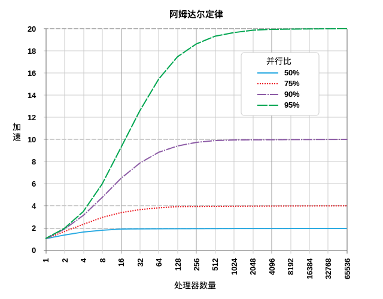
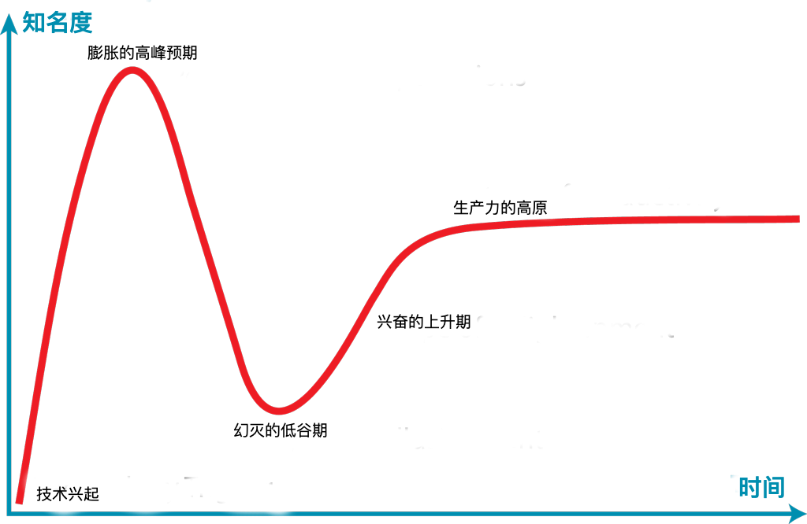

[hacker-laws](https://github.com/dwmkerr/hacker-laws) 的的中文翻译。

对开发人员有用的定律、理论、原则和模式。(Laws, Theories, Principles and Patterns that developers will find useful.)

为了方便阅读，维基百科增加了中文链接。英文链接表示 [hacker-laws](https://github.com/dwmkerr/hacker-laws) 项目尚未完成的主题。

[中国无法访问维基百科说明](gfw.md)

喜欢点 **star** 、关注点 **watch** 、贡献点 **fork** 。翻译错漏之处，欢迎指正！

- [介绍](#%e4%bb%8b%e7%bb%8d)
- [定律](#%e5%ae%9a%e5%be%8b)
  - [阿姆达尔定律 (Amdahl's Law)](#%e9%98%bf%e5%a7%86%e8%be%be%e5%b0%94%e5%ae%9a%e5%be%8b-amdahls-law)
  - [破窗效应 (The Broken Windows Theory)](#%e7%a0%b4%e7%aa%97%e6%95%88%e5%ba%94-the-broken-windows-theory)
  - [布鲁克斯法则 (Brooks's Law)](#%e5%b8%83%e9%b2%81%e5%85%8b%e6%96%af%e6%b3%95%e5%88%99-brookss-law)
  - [康威定律 (Conway's Law)](#%e5%ba%b7%e5%a8%81%e5%ae%9a%e5%be%8b-conways-law)
  - [坎宁汉姆定律 (Cunningham's Law)](#%e5%9d%8e%e5%ae%81%e6%b1%89%e5%a7%86%e5%ae%9a%e5%be%8b-cunninghams-law)
  - [邓巴数字 (Dunbar's Number)](#%e9%82%93%e5%b7%b4%e6%95%b0%e5%ad%97-dunbars-number)
  - [盖尔定律 (Gall's Law)](#%e7%9b%96%e5%b0%94%e5%ae%9a%e5%be%8b-galls-law)
  - [古德哈特定律 (Goodhart's Law)](#%e5%8f%a4%e5%be%b7%e5%93%88%e7%89%b9%e5%ae%9a%e5%be%8b-goodharts-law)
  - [汉隆的剃刀（Hanlon's Razor）](#%e6%b1%89%e9%9a%86%e7%9a%84%e5%89%83%e5%88%80hanlons-razor)
  - [侯世达定律 (Hofstadter's Law)](#%e4%be%af%e4%b8%96%e8%be%be%e5%ae%9a%e5%be%8b-hofstadters-law)
  - [哈伯特定律 (Hutber's Law)](#%e5%93%88%e4%bc%af%e7%89%b9%e5%ae%9a%e5%be%8b-hutbers-law)
  - [技术成熟度曲线 (The Hype Cycle or Amara's Law)](#%e6%8a%80%e6%9c%af%e6%88%90%e7%86%9f%e5%ba%a6%e6%9b%b2%e7%ba%bf-the-hype-cycle-or-amaras-law)
  - [隐式接口定律 (Hyrum's Law or The Law of Implicit Interfaces)](#%e9%9a%90%e5%bc%8f%e6%8e%a5%e5%8f%a3%e5%ae%9a%e5%be%8b-hyrums-law-or-the-law-of-implicit-interfaces)
  - [梅特卡夫定律 (Metcalfe's Law)](#%e6%a2%85%e7%89%b9%e5%8d%a1%e5%a4%ab%e5%ae%9a%e5%be%8b-metcalfes-law)
  - [摩尔定律 (Moore's Law)](#%e6%91%a9%e5%b0%94%e5%ae%9a%e5%be%8b-moores-law)
  - [墨菲定律 (Murphy's Law / Sod's Law)](#%e5%a2%a8%e8%8f%b2%e5%ae%9a%e5%be%8b-murphys-law--sods-law)
  - [帕金森定理 (Parkinson's Law)](#%e5%b8%95%e9%87%91%e6%a3%ae%e5%ae%9a%e7%90%86-parkinsons-law)
  - [过早优化效应 (Premature Optimization Effect)](#%e8%bf%87%e6%97%a9%e4%bc%98%e5%8c%96%e6%95%88%e5%ba%94-premature-optimization-effect)
  - [普特定律 (Putt's Law)](#%e6%99%ae%e7%89%b9%e5%ae%9a%e5%be%8b-putts-law)
  - [里德定律 (Reed's Law)](#%e9%87%8c%e5%be%b7%e5%ae%9a%e5%be%8b-reeds-law)
  - [复杂性守恒定律 (The Law of Conservation of Complexity or Tesler's Law)](#%e5%a4%8d%e6%9d%82%e6%80%a7%e5%ae%88%e6%81%92%e5%ae%9a%e5%be%8b-the-law-of-conservation-of-complexity-or-teslers-law)
  - [抽象泄漏定律 (The Law of Leaky Abstractions)](#%e6%8a%bd%e8%b1%a1%e6%b3%84%e6%bc%8f%e5%ae%9a%e5%be%8b-the-law-of-leaky-abstractions)
  - [帕金森琐碎定理 (The Law of Triviality)](#%e5%b8%95%e9%87%91%e6%a3%ae%e7%90%90%e7%a2%8e%e5%ae%9a%e7%90%86-the-law-of-triviality)
  - [Unix 哲学 (The Unix Philosophy)](#unix-%e5%93%b2%e5%ad%a6-the-unix-philosophy)
  - [Spotify 模型 (The Spotify Model)](#spotify-%e6%a8%a1%e5%9e%8b-the-spotify-model)
  - [沃德勒定律 (Wadler's Law)](#%e6%b2%83%e5%be%b7%e5%8b%92%e5%ae%9a%e5%be%8b-wadlers-law)
  - [惠顿定律 (Wheaton's Law)](#%e6%83%a0%e9%a1%bf%e5%ae%9a%e5%be%8b-wheatons-law)
- [原则](#%e5%8e%9f%e5%88%99)
  - [呆伯特法则 (The Dilbert Principle)](#%e5%91%86%e4%bc%af%e7%89%b9%e6%b3%95%e5%88%99-the-dilbert-principle)
  - [帕累托法则 (The Pareto Principle or The 80/20 Rule)](#%e5%b8%95%e7%b4%af%e6%89%98%e6%b3%95%e5%88%99-the-pareto-principle-or-the-8020-rule)
  - [彼得原理 (The Peter Principle)](#%e5%bd%bc%e5%be%97%e5%8e%9f%e7%90%86-the-peter-principle)
  - [鲁棒性原则 (The Robustness Principle or Postel's Law)](#%e9%b2%81%e6%a3%92%e6%80%a7%e5%8e%9f%e5%88%99-the-robustness-principle-or-postels-law)
  - [SOLID](#solid)
  - [单一功能原则 (The Single Responsibility Principle)](#%e5%8d%95%e4%b8%80%e5%8a%9f%e8%83%bd%e5%8e%9f%e5%88%99-the-single-responsibility-principle)
  - [开闭原则 (The Open/Closed Principle)](#%e5%bc%80%e9%97%ad%e5%8e%9f%e5%88%99-the-openclosed-principle)
  - [里氏替换原则 (The Liskov Substitution Principle)](#%e9%87%8c%e6%b0%8f%e6%9b%bf%e6%8d%a2%e5%8e%9f%e5%88%99-the-liskov-substitution-principle)
  - [接口隔离原则 (The Interface Segregation Principle)](#%e6%8e%a5%e5%8f%a3%e9%9a%94%e7%a6%bb%e5%8e%9f%e5%88%99-the-interface-segregation-principle)
  - [依赖反转原则 (The Dependency Inversion Principle)](#%e4%be%9d%e8%b5%96%e5%8f%8d%e8%bd%ac%e5%8e%9f%e5%88%99-the-dependency-inversion-principle)
  - [不要重复你自己原则 (The DRY Principle)](#%e4%b8%8d%e8%a6%81%e9%87%8d%e5%a4%8d%e4%bd%a0%e8%87%aa%e5%b7%b1%e5%8e%9f%e5%88%99-the-dry-principle)
  - [KISS 原则 (The KISS Principle)](#kiss-%e5%8e%9f%e5%88%99-the-kiss-principle)
  - [你不需要它原则 (YAGNI)](#%e4%bd%a0%e4%b8%8d%e9%9c%80%e8%a6%81%e5%ae%83%e5%8e%9f%e5%88%99-yagni)
  - [分布式计算的谬论 (The Fallacies of Distributed Computing)](#%e5%88%86%e5%b8%83%e5%bc%8f%e8%ae%a1%e7%ae%97%e7%9a%84%e8%b0%ac%e8%ae%ba-the-fallacies-of-distributed-computing)
- [阅读清单](#%e9%98%85%e8%af%bb%e6%b8%85%e5%8d%95)
- [TODO](#todo)

## 介绍

当人们谈论开发时，会聊到许多定律。这个仓库收录了一些最常见的定律。

❗: 这个仓库包含对一些定律、原则以及模式的解释，但不**提倡**其中任何一个。 它们的应用始终存在着争论，并且很大程度上取决于你正在做什么。

## 定律

现在我们开始吧！

### 阿姆达尔定律 (Amdahl's Law)

- [英文维基百科](https://en.wikipedia.org/wiki/Amdahl%27s_law)
- [中文维基百科](https://zh.wikipedia.org/wiki/%E9%98%BF%E5%A7%86%E8%BE%BE%E5%B0%94%E5%AE%9A%E5%BE%8B)

> 阿姆达尔定律是一个显示计算任务**潜在加速**能力的公式。这种能力可以通过增加系统资源来实现，通常用于并行计算中。它可以预测增加处理器数量的实际好处，然而增加处理器数量会受到程序并行性的限制。

举例说明：如果程序由两部分组成，部分 A 必须由单个处理器执行，部分 B 可以并行运行。那么向执行程序的系统添加多个处理器只能获得有限的好处。它可以极大地提升部分 B 的运行速度，但部分 A 的运行速度将保持不变。

下图展示了一些运行速度的提升潜能的例子：

_(图片来源: By Daniels220 at English Wikipedia, Creative Commons Attribution-Share Alike 3.0 Unported, https://en.wikipedia.org/wiki/File:AmdahlsLaw.svg)_

可以看出，50％ 并行化的程序在使用大于 10 个处理单元之后的速度提升收效甚微，而 95％ 并行化的程序在使用超过一千个处理单元之后仍然可以显著提升速度。

随着[摩尔定律](#%E6%91%A9%E5%B0%94%E5%AE%9A%E5%BE%8B-moores-law)减慢，单个处理器的速度增加缓慢，并行化是提高性能的关键。图形编程是一个极好的例子，现代着色器可以并行渲染单个像素或片段。这也是现代显卡通常具有数千个处理核心（GPU 或着色器单元）的原因。

参见：

- [布鲁克斯法则](#%E5%B8%83%E9%B2%81%E5%85%8B%E6%96%AF%E6%B3%95%E5%88%99-brookss-law)
- [摩尔定律](#%E6%91%A9%E5%B0%94%E5%AE%9A%E5%BE%8B-moores-law)

### 破窗效应 (The Broken Windows Theory)

- [英文维基百科](https://en.wikipedia.org/wiki/Broken_windows_theory)
- [中文维基百科](https://zh.wikipedia.org/wiki/%E7%A0%B4%E7%AA%97%E6%95%88%E5%BA%94)

在破窗理论中认为，一些明显的犯罪迹象(或缺乏环保意识)会导致进一步的、更严重的犯罪(或环境的进一步恶化)。

破窗理论已应用于软件开发中，它表明劣质代码(或 [Technical Debt](#TODO))可能会影响后续优化的效率，从而进一步造成代码劣化；随着时间的推移，这种效应将会导致代码质量大幅下降。

参见：

- [Technical Debt](#TODO)

例子：

- [《程序员修炼之道：软件熵》(The Pragmatic Programming: Software Entropy)](https://pragprog.com/the-pragmatic-programmer/extracts/software-entropy)
- [《Coding Horror：破窗效应》(Coding Horror: The Broken Window Theory)](https://blog.codinghorror.com/the-broken-window-theory/)
- [《开源：编程之乐 - 破窗效应》(OpenSource: Joy of Programming - The Broken Window Theory)](https://opensourceforu.com/2011/05/joy-of-programming-broken-window-theory/)

### 布鲁克斯法则 (Brooks's Law)

- [英文维基百科](https://en.m.wikipedia.org/wiki/Brooks%27s_law)

> 软件开发后期，添加人力只会使项目开发得更慢。

这个定律表明，在许多情况下，试图通过增加人力来加速已延期项目的交付，将会使项目交付得更晚。布鲁克斯也明白，这是一种过度简化。但一般的论据是，新资源的时间增加和通信开销，会在短期内使开发速度减慢。而且，许多任务是密不可分的，换句话说，这样可以使更多的资源之间能轻易分配，这也意味着潜在的速度增长也更低。

谚语 **九个女人不能在一个月内生一个孩子** 与布鲁克斯法则同出一辙，特别是某些不可分割或者并行的工作。

这是[《人月神话》](#%E9%98%85%E8%AF%BB%E6%B8%85%E5%8D%95)的中心主题。

参见：

- [Death March](#todo)
- [阅读清单：《人月神话》](#%E9%98%85%E8%AF%BB%E6%B8%85%E5%8D%95)

### 康威定律 (Conway's Law)

- [英文维基百科](https://en.wikipedia.org/wiki/Conway%27s_law)
- [中文维基百科](https://zh.wikipedia.org/wiki/%E5%BA%B7%E5%A8%81%E5%AE%9A%E5%BE%8B)

这个定律说明了系统的技术边界可以反应一个组织的结构，它通常会在改进组织时被提及。康威定律表明，如果一个组织被分散成许多小而无联系的单元，那么它开发的软件也是小而分散的。如果组织是更多地围绕以功能或服务为导向的**垂直**结构，那么软件系统也会反映这一点。

参见：

- [The Spotify Model](#spotify-%E6%A8%A1%E5%9E%8B-the-spotify-model)

### 坎宁汉姆定律 (Cunningham's Law)

- [英文维基百科](https://en.wikipedia.org/wiki/Ward_Cunningham#Cunningham's_Law)

> 在网络上想得到正确答案的最好方法不是提问题，而是发布一个错误的答案。

据史蒂芬·麦克基迪说，沃德·坎宁汉姆早在 20 世纪 80 年代早期的时候建议他，在互联网上获得正确答案的最好方法不是提问题，而是发布一个错误的答案。麦克基迪称这为坎宁汉姆定律，而坎宁汉姆不以为然，并觉得这是“错误的引用”。最初这条定律只是用于描述 Usenet 上的社交行为，但后来也渐渐用于其他的在线社区（如 Wikipedia、Reddit、Twitter、Facebook 等）。

参见：

- [XKCD 386: "Duty Calls"](https://xkcd.com/386/)

### 邓巴数字 (Dunbar's Number)

- [英文维基百科](https://en.wikipedia.org/wiki/Dunbar%27s_number)

邓巴数字是对一个人能够保持稳定社会关系的人数的认知极限——在这种关系中，一个人知道每个人是谁，也知道每个人与其他人的关系如何。而对这一数字的确切值则有着一些不同意见。邓巴指出，人仅能轻松地维持 150 个稳定的关系。这样的关系在一个更社会化的背景中，便是当你碰巧在酒吧里碰到这些人时候，你不会因为加入他们而感到尴尬。邓巴数字的估计值一般在 100 至 250 之间。

和人与人之间稳定的关系一样，开发人员与代码库的关系也需要努力维护。当面对大型、复杂的项目，或许多项目的归属权时，我们会依赖于约定、策略和建模过程来进行扩展。邓巴数字不仅在办公室规模的扩大的过程中举足轻重，而且在设置团队工作范围，或决定系统何时应该注重于辅助建模和组织管理开销自动化的工具时，也是非常重要的。将邓巴数字放入工程内容中进行类比，那就是您能加入并有信心随叫随到进行轮换的项目数(亦或是单个项目的规范化复杂性)。

参见：

- [康威定律](#%e5%ba%b7%e5%a8%81%e5%ae%9a%e5%be%8b-conways-law)

### 盖尔定律 (Gall's Law)

- [英文维基百科](<https://en.wikipedia.org/wiki/John_Gall_(author)#Gall's_law>)

> 一个切实可行的复杂系统势必是从一个切实可行的简单系统发展而来的。从头开始设计的复杂系统根本不切实可行，无法修修补补让它切实可行。你必须由一个切实可行的简单系统重新开始。
>
> [约翰·盖尔](<https://en.wikipedia.org/wiki/John_Gall_(author)>) (John Gall)

盖尔定律说明了设计高度复杂的系统很可能会失败。它们很难一蹴而就，更多是从简单的系统逐渐演变而来。

最典型的例子便是互联网。如今的互联网是一个高度复杂的系统，而它最早只是被定义为一种在学术机构之间共享内容的方式。互联网成功实现了最初的目标，并且随着时间不断演化，最终成就了如今的复杂繁荣。

参见：

- [KISS 原则 (保持简单和直白)](#kiss-%e5%8e%9f%e5%88%99-the-kiss-principle)

### 古德哈特定律 (Goodhart's Law)

- [英文维基百科](https://en.wikipedia.org/wiki/Goodhart's_law)
- [中文维基百科](https://zh.wikipedia.org/wiki/%E5%8F%A4%E5%BE%B7%E5%93%88%E7%89%B9%E5%AE%9A%E5%BE%8B)

> 当压力施于其上以进行控制时，任何观测到的统计恒性都倾向消散。
>
> _查尔斯·古德哈特 (Charles Goodhart)_

另见：

> 当一个措施本身成为目标时，它就不再是一个好的措施。
>
> _玛丽莲·斯特拉腾 (Marilyn Strathern)_

根据这一定律，由测量驱动的优化反而可能导致测量结果本身的说服力下降。盲目使用一些过度严格筛选的方法 ([KPIs](https://zh.wikipedia.org/wiki/%E9%97%9C%E9%8D%B5%E7%B8%BE%E6%95%88%E6%8C%87%E6%A8%99)) 可能会产生一些不良的影响。人们会倾向于用“钻空子”的行为去做局部优化，从而满足一些特定的度量标准，而不会在意整体的结果。

现实中的例子：

- Assert-free 测试可以达到代码覆盖率的预期，但度量的目的应该是创造经过良好测试的软件。
- 由 commits 的行数来评价开发人员的表现，从而导致了不合理的代码库扩增。

参见

- [古德哈特定律：错误的测量如何导致不道德的行为](https://coffeeandjunk.com/goodharts-campbells-law/)
- [呆伯特与无 bug 软件](https://dilbert.com/strip/1995-11-13)

### 汉隆的剃刀（Hanlon's Razor）

- [英文维基百科](https://en.wikipedia.org/wiki/Hanlon%27s_razor)
- [中文维基百科](https://zh.wikipedia.org/wiki/%E6%B1%89%E9%9A%86%E7%9A%84%E5%89%83%E5%88%80)

> 能解释为愚蠢的，就不要解释为恶意的。
>
> _罗伯特·汉隆 (Robert J. Hanlon)_

这一原则表明，一个行为所产生的消极结果并不是恶意。相反，消极结果更有可能归咎于这些没有得到充分理解的行动或影响。

### 侯世达定律 (Hofstadter's Law)

- [英文维基百科](https://en.wikipedia.org/wiki/Hofstadter%27s_law)
- [中文维基百科](https://zh.wikipedia.org/wiki/%E4%BE%AF%E4%B8%96%E8%BE%BE%E5%AE%9A%E5%BE%8B)

> 即使考虑到侯世达定律，它也总是比你预期的要长。
>
> 侯世达 (Douglas Hofstadter)

在估计需要多长时间开发时，你可能会听到此定律。软件开发似乎有这样一条定理，即我们往往不能准确地估计需要多长时间才能完成。

语出[《哥德尔、艾舍尔、巴赫：集异璧之大成》](#%E9%98%85%E8%AF%BB%E6%B8%85%E5%8D%95)。

参见：

- [阅读清单：《哥德尔、艾舍尔、巴赫：集异璧之大成》](#%E9%98%85%E8%AF%BB%E6%B8%85%E5%8D%95)

### 哈伯特定律 (Hutber's Law)

- [英文维基百科](https://en.wikipedia.org/wiki/Hutber%27s_law)

> 改善即恶化。
>
> [帕特里克·哈伯特](https://en.wikipedia.org/wiki/Patrick_Hutber) (Patrick Hutber)

这个定律说明了对一个系统的改进会导致其他部分的恶化；或者它会将其他的恶化隐藏起来，并导致系统整体状态的退化。

例如，某个端点的响应延迟减少，就可能导致请求流中的吞吐量和容量问题进一步增加，并影响到另一个完全不同的子系统。

### 技术成熟度曲线 (The Hype Cycle or Amara's Law)

- [英文维基百科](https://en.wikipedia.org/wiki/Hype_cycle)
- [中文维基百科](https://zh.wikipedia.org/wiki/%E6%8A%80%E6%9C%AF%E6%88%90%E7%86%9F%E5%BA%A6%E6%9B%B2%E7%BA%BF)

> 我们倾向于过高估计技术在短期内的影响，并低估长期效应。
>
> _罗伊·阿马拉 (Roy Amara)_

技术成熟度曲线是[高德纳咨询公司](https://zh.wikipedia.org/wiki/%E9%AB%98%E5%BE%B7%E7%BA%B3%E5%92%A8%E8%AF%A2%E5%85%AC%E5%8F%B8)对技术最初兴起和发展的视觉展现。一图顶千言：

_(图片来源: By Jeremykemp at English Wikipedia, CC BY-SA 3.0, https://commons.wikimedia.org/w/index.php?curid=10547051)_

简而言之，这个周期表明，新技术及其潜在影响通常会引发一阵浪潮。团队快速使用这些新技术，有时会对结果感到失望。这可能是因为该技术还不够成熟，或者现实应用还没有完全实现。经过一段时间后，技术的能力提高了，使用它的实际机会会增加，最终团队也可以提高工作效率。罗伊·阿马拉简洁地总结了这一点：我们倾向于高估技术短期内的影响，并低估长期效应。

### 隐式接口定律 (Hyrum's Law or The Law of Implicit Interfaces)

- [英文在线地址](http://www.hyrumslaw.com/)

> 当 API 有足够多的用户时，你在合同中的承诺已不重要：你系统的所有可观察行为都将被某些人所依赖。
>
> _海伦·赖特（Hyrum Wright）_

隐式接口定律表明，当你的 API 有足够多的用户时，API 的所有行为（包括那些未囊括在公共说明中的一部分）最终都会被其他人所依赖。 一个简单的例子是 API 的响应时间这种非功能性因素，还有一个更微妙的例子是：用户使用正则表达式判断错误信息的类型时，即使 API 的公共说明没有说明消息的内容，来指示用户错误的类型，一些用户也可能会使用并更改该消息，而这实际上会破坏 API 的使用。

参见：

- [抽象泄漏定律](#%E6%BC%8F%E6%B4%9E%E6%8A%BD%E8%B1%A1%E5%AE%9A%E5%BE%8B-the-law-of-leaky-abstractions)
- [XKCD 1172](https://xkcd.com/1172/)

### 梅特卡夫定律 (Metcalfe's Law)

- [英文维基百科](https://en.wikipedia.org/wiki/Metcalfe's_law)
- [中文维基百科](https://zh.wikipedia.org/wiki/%E6%A2%85%E7%89%B9%E5%8D%A1%E5%A4%AB%E5%AE%9A%E5%BE%8B)

> 在网络理论中，系统的价值约等于系统用户数的平方。

这个定律基于一个系统中可能的连接对数量，并且与[里德定律](#%e9%87%8c%e5%be%b7%e5%ae%9a%e5%be%8b-reeds-law)十分相近。奥德利兹科 (Odlyzko) 和其他人认为，里德定律和梅特卡夫定律夸大了系统本身的价值，因为它们没有考虑到网络效应中人类认知的限制。

参见:

- [里德定律](#%e9%87%8c%e5%be%b7%e5%ae%9a%e5%be%8b-reeds-law)
- [邓巴数字](#%e9%82%93%e5%b7%b4%e6%95%b0%e5%ad%97-dunbars-number)

### 摩尔定律 (Moore's Law)

- [英文维基百科](https://en.wikipedia.org/wiki/Moore%27s_law)
- [中文维基百科](https://zh.wikipedia.org/wiki/%E6%91%A9%E5%B0%94%E5%AE%9A%E5%BE%8B)

> 集成电路中的晶体管数量大约每两年翻一番。

这条定律通常用于说明半导体和芯片技术提高的绝对速度。从 20 世纪 70 年代到 21 世纪前十年，摩尔的预测被证明是高度准确的。 近年来，这种趋势略有变化，部分原因受到[量子隧穿效应](https://zh.wikipedia.org/wiki/%E9%87%8F%E5%AD%90%E7%A9%BF%E9%9A%A7%E6%95%88%E6%87%89)影响。然而，并行化计算的进步以及半导体技术和量子计算潜在的革命性变化，可能意味着摩尔定律在未来几十年内继续保持正确。

### 墨菲定律 (Murphy's Law / Sod's Law)

- [英文维基百科](https://en.wikipedia.org/wiki/Murphy%27s_law)
- [中文维基百科](https://zh.wikipedia.org/wiki/%E6%91%A9%E8%8F%B2%E5%AE%9A%E7%90%86)

> 凡是可能出错的事就一定会出错。

出自 [爱德华·A·墨菲](https://en.wikipedia.org/wiki/Edward_A._Murphy_Jr.) ， _墨菲定律_ 说明了如果一件事有可能出错，那么就一定会出错。

这是一句开发人员间的俗语，在开发、测试甚至在生产中都有可能会发生一些令人意想不到的事情。而这一定律也可以参考在英式英语中更为常见的 _索德定理_ ：

> 如果某件事可能出错，那么它一定会在最糟糕的时候发生。

这些定律常常用于幽默嘲弄。但是，类似于 [_Confirmation Bias_](#TODO) 和 [_Selection Bias_](#TODO) 的现象很容易导致人们过分强调这些定律（即在大部分情况下，一件事的成功会显得司空见惯；而失败才会引起更多的注意和讨论）。

参见:

- [Confirmation Bias](#TODO)
- [Selection Bias](#TODO)

### 帕金森定理 (Parkinson's Law)

- [英文维基百科](https://en.wikipedia.org/wiki/Parkinson%27s_law)
- [中文维基百科](https://zh.wikipedia.org/wiki/%E5%B8%95%E9%87%91%E6%A3%AE%E5%AE%9A%E7%90%86)

> 在工作能够完成的时限内，工作量会一直增加，直到所有可用时间都被填满为止。

基于官僚机构的研究背景，该定律被应用于软件开发中。该理论认为，团队在截止日期之前效率低下，然后在截止日期前赶紧完成工作，从而使实际截止日期变得随意。

将这个定理与[侯世达定律](#%E4%BE%AF%E4%B8%96%E8%BE%BE%E5%AE%9A%E5%BE%8B-hofstadters-law)相结合，则会获得更加悲观的观点：为了在规定时间内完成工作，工作将增多，花费比预期更长的时间。

参见：

- [侯世达定律](#%E4%BE%AF%E4%B8%96%E8%BE%BE%E5%AE%9A%E5%BE%8B-hofstadters-law)

### 过早优化效应 (Premature Optimization Effect)

- [英文在线网站](http://wiki.c2.com/?PrematureOptimization)

> 过早优化是万恶之源。
>
> [高德纳 (唐纳德克努特的中文名)](https://twitter.com/realdonaldknuth?lang=en)

在高德纳的[《goto 语句的结构化编程》](http://wiki.c2.com/?StructuredProgrammingWithGoToStatements)论文中，他写到：“程序员们浪费了大量的时间去思考或者担心他们的程序中的非关键部分的速度。而在考虑调试和维护的时候，这些所谓提高效率的做法实际上十分不妥。我们应该放弃小的效率点，并且要在 97% 的时间提醒自己，**过早优化是万恶之源**。而且连那关键的 3% 也不能够放过。”

然而，_过早优化_ （简而言之）可以定义为在我们知道需要做什么之前进行优化。

### 普特定律 (Putt's Law)

- [英文维基百科](https://en.wikipedia.org/wiki/Putt%27s_Law_and_the_Successful_Technocrat)

> 技术由两类人主导，一类是纯粹的管理人员， 一类是纯粹的技术人员。

普特定律常常遵循普特推论：

> 每一个技术层次，假以时日，能力将逆转。

这些结论表明，由于各种选择标准和群体组织的趋势，技术组织的工作层面将有一些技术人员，以及一些不了解复杂性和挑战的管理人员。这种现象可能是由于 [The Peter Principe](#TODO) 或 [Dilbert's Law](#TODO) 造成的。

但是，应该强调的是，诸如此类的定律是一种广泛的概括，可能适用于某些类型的组织，而不适用于其他组织。

参见：

- [The Peter Principe](#TODO)
- [Dilbert's Law](#TODO).

### 里德定律 (Reed's Law)

- [英文维基百科](https://en.wikipedia.org/wiki/Reed's_law)

> 大型网络，尤其是社交网络的效用会随着网络的大小呈指数级扩增。

这一定律基于图论，图论中的效用与可能的子组数量呈正比，并且该增长速度会比参与者的数量和可能的连接对数量要快。奥德利兹科 (Odlyzko) 和其他人认为，里德定律夸大了系统本身的价值，因为它们没有考虑到网络效应中人类认知的限制。

参见:

- [梅特卡夫定律 (Metcalfe's Law)](#%e6%a2%85%e7%89%b9%e5%8d%a1%e5%a4%ab%e5%ae%9a%e5%be%8b-metcalfes-law)
- [邓巴数字](#%e9%82%93%e5%b7%b4%e6%95%b0%e5%ad%97-dunbars-number)

### 复杂性守恒定律 (The Law of Conservation of Complexity or Tesler's Law)

- [英文维基百科](https://en.wikipedia.org/wiki/Law_of_conservation_of_complexity)

该定律表明系统中存在着一定程度的复杂性，并且不能减少。

系统中的某些复杂性是**无意的**。这是由于结构不良，错误或者糟糕的建模造成的。这种无意的复杂性可以减少或者消除。然而，由于待解决问题固有的复杂性，某些复杂性是**内在的**。这种复杂性可以转移，但不能消除。

该定律有趣的一点是，即使简化整个系统，内在的复杂性也不会降低。它会**转移到用户**，并且用户必须以更复杂的方式行事。

### 抽象泄漏定律 (The Law of Leaky Abstractions)

- [英文在线地址](https://www.joelonsoftware.com/2002/11/11/the-law-of-leaky-abstractions/)

> 在某种程度上，所有非平凡的抽象都是有泄漏的。
>
> [乔尔斯·波尔斯基](https://twitter.com/spolsky) (Joel Spolsky)

该定律指出，通常用于简化复杂系统的抽象，在某些情况下将底层系统泄漏出来，使得抽象表现出意外的行为。

例如加载文件并读取其内容。文件系统 API 是较低级别内核系统的抽象，它们本身是与磁盘（或 SSD 的闪存）上的数据更改相关的物理过程的抽象。在大多数情况下，处理文件（如二进制数据流）的抽象将起作用。但是，对于磁盘驱动器，顺序读取数据将比随机访问快得多（由于页面错误的开销增加）。但对于 SSD 驱动器，此开销不会出现。需要理解基础细节来处理这种情况（例如，数据库索引文件的良好结构可以减少随机访问的开销），开发人员需要合理的抽象，来处理不同的细节。

当引入更多的抽象时，上面的例子会变得更复杂。Linux 操作系统允许通过网络访问文件，但在本地表示为**普通**文件。如果存在网络故障，这种抽象将会**泄漏**。如果开发人员将这些文件视为**普通**文件，而不考虑它们可能会受到网络延迟和故障的影响，那么解决方案就会出错。

描述该定律的文章表明，过度依赖抽象，加上对底层过程的理解不足，实际上使得问题在某些情况下更加复杂。

参见：

- [隐式接口定律](#%E9%9A%90%E5%BC%8F%E6%8E%A5%E5%8F%A3%E5%AE%9A%E5%BE%8B-hyrums-law)

真实的例子：

- [Photoshop 启动缓慢](https://forums.adobe.com/t
